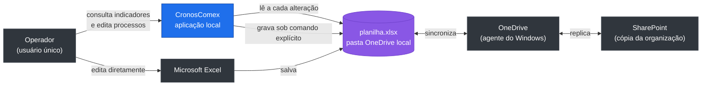
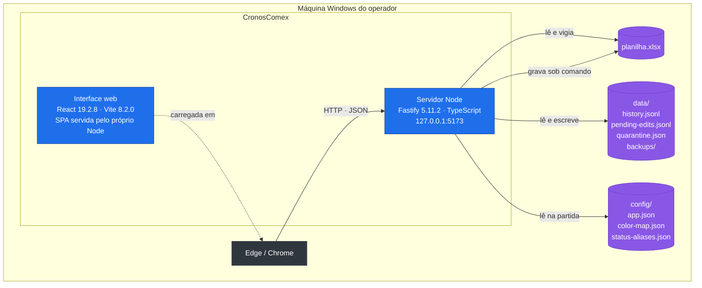
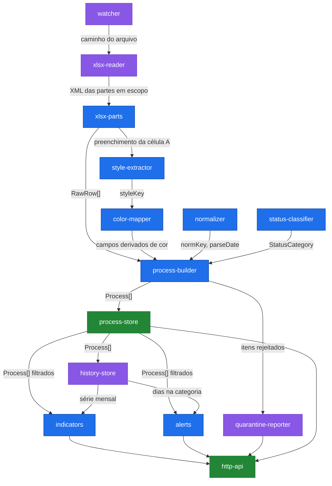
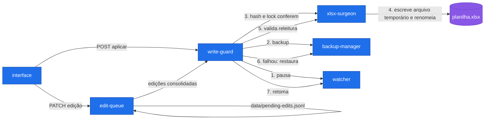
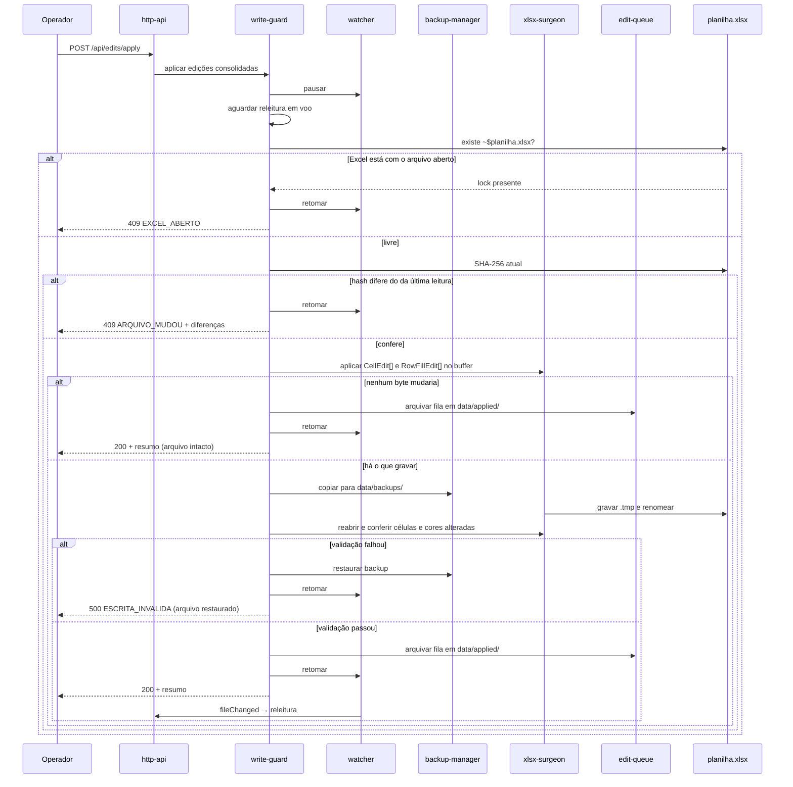
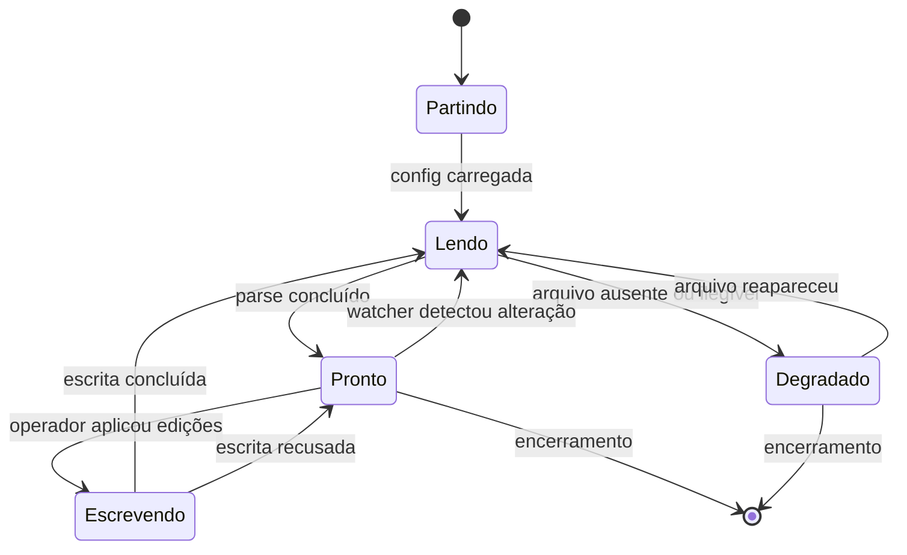

# 04 — Arquitetura

## 1. Contexto do sistema



**Fronteira do sistema:** apenas o bloco `CronosComex`. OneDrive, SharePoint e
Excel são atores externos que a aplicação não controla e sobre os quais não faz
suposição de disponibilidade. A aplicação não realiza nenhuma chamada de rede
externa (RNF-31).

---

## 2. Containers



| Container | Responsabilidade | Tecnologia |
|---|---|---|
| **Servidor Node** | Ler a planilha, calcular indicadores e alertas, servir a API e a SPA, gravar no `.xlsx` sob comando | Node 22 · Fastify 5.11.2 · TypeScript 7.0.2 |
| **Interface web** | Apresentar as **sete páginas** — as seis do menu, mais o detalhe do processo, que vive fora dele (`web/src/router.ts`) —, os filtros globais e o formulário de edição. **Nenhuma regra de negócio** (RNF-38) | React 19.2.8 · Vite 8.2.0 · Tailwind 4.3.3 · Recharts 3.10.1 |
| **planilha.xlsx** | Fonte da verdade. Não pertence ao sistema | Arquivo OOXML |
| **data/** | Histórico, fila de edições, quarentena e backups. Descartável sem perda de dado de negócio | JSONL, JSON, XLSX |
| **config/** | Caminho do arquivo, mapa de cores, dicionário de grafias | JSON |

O servidor escuta exclusivamente em `127.0.0.1` (RNF-29): não há superfície de
rede, e por isso não há autenticação (RNF-32).

### As duas portas de desenvolvimento são distintas e fixas

A API atende em **5173** e o Vite em **5174**. **Isso foi um defeito real:**
`5173` estava escrito em `DEFAULTS.port`, no proxy do Vite **e** era o padrão do
próprio Vite — os três coincidiam, e a cadeia só funcionava por acidente de
ordem. Subindo a API primeiro, o Vite achava a porta ocupada e deslizava para
`5174`; na ordem inversa o Vite tomava a `5173`, a API morria com `EADDRINUSE`,
e o proxy passava a apontar para o próprio Vite — que devolve HTML onde a casca
espera JSON, produzindo "Sem contato com o servidor" e apontando para a causa
errada. Agora `web/vite.config.ts` lê a porta da API de `config/app.json` (fonte
única) e usa `strictPort`, que falha alto em vez de escolher outra em silêncio.

`npm run dev` sobe os dois por `scripts/dev.mjs`, sem dependência nova — o `&`
do shell não serve porque a máquina do operador é Windows (RNF-26), onde o `npm`
invoca `cmd`. Um processo caindo derruba o outro: meia aplicação no ar parece
saudável e não é.

---

## 3. Componentes do módulo de ingestão e cálculo



Azul = função pura, sem I/O, testável isoladamente. Roxo = componente com
efeito colateral em disco. Verde = fronteira.

| Componente | Responsabilidade (uma frase) | Entrada | Saída |
|---|---|---|---|
| `watcher` | Detectar alteração do `.xlsx` e disparar reprocessamento com debounce | Caminho do arquivo, sinal de pausa | Evento `fileChanged` |
| `xlsx-reader` | Abrir o arquivo, resolver qual aba está em escopo e descomprimir **somente** as partes dela — as demais abas nunca são infladas (regra inviolável 10) | Caminho do arquivo | `RawRow[]`, hash SHA-256 do arquivo |
| `xlsx-parts` | Interpretar as partes XML — pool de texto, estilos e `sheetData` — em célula, tipo e chave de estilo. Puro: recebe string, devolve dado | XML de `sharedStrings`, `styles` e da aba | `RawRow[]` |
| `style-extractor` | Converter o preenchimento da célula na chave de estilo literal, sem resolver cor | `fgColor` de `xl/styles.xml` | `styleKey: string` |
| `color-mapper` | Traduzir a chave de estilo em responsável, canal e localização do importador | `styleKey`, `color-map.json` | `{ responsible, customsChannel, importerOutsideRj }` ou não-mapeado |
| `normalizer` | Normalizar texto para agrupamento e converter célula em data | `string \| number \| Date` | `string` normalizada, `Date \| null`, anomalias |
| `status-classifier` | Aplicar TD-01 e devolver a categoria canônica | `RawRow`, `status-aliases.json` | `StatusCategory`, anomalias |
| `process-builder` | Compor o `Process` a partir dos anteriores e decidir aceite ou quarentena | `RawRow[]` e os módulos acima | `Process[]`, `QuarantineItem[]` |
| `quarantine-reporter` | Persistir o relatório de linhas não interpretadas e de divergências | `QuarantineItem[]` | `data/quarantine.json` |
| `process-store` | Guardar o conjunto corrente em memória e aplicar os filtros globais | `Process[]`, `FilterSet` | `Process[]` filtrado |
| `history-store` | Detectar mudanças de categoria, gravá-las e responder há quantos dias cada processo está parado | `Process[]` | `data/history.jsonl`, `Map<ref, dias>`, série mensal |
| `indicators` | Calcular os 21 indicadores em escopo sobre um conjunto já filtrado | `Process[]` | `IndicatorSet` |
| `alerts` | Calcular os 6 alertas e ordená-los por severidade | `Process[]`, dias parados | `Alert[]` |
| `http-api` | Expor os contratos de `05-contratos-api.md` e servir a SPA | Requisição HTTP | Resposta JSON |

### 3.1. Componentes de escrita



| Componente | Responsabilidade (uma frase) | Entrada | Saída |
|---|---|---|---|
| `edit-queue` | Registrar, consolidar e descartar edições ainda não aplicadas | `EditCommand` | `data/pending-edits.jsonl`, projeção consolidada |
| `write-guard` | Orquestrar a sequência de defesas e abortar ao primeiro sinal de risco | Edições consolidadas | `WriteResult` com motivo em caso de recusa |
| `xlsx-surgeon` | Alterar somente os nós `<c>` das células afetadas dentro do zip, preservando todo o resto byte a byte | Buffer do `.xlsx`, `CellEdit[]` | Buffer do `.xlsx` novo |
| `backup-manager` | Copiar o arquivo antes da escrita, restaurá-lo em caso de falha e expurgar backups vencidos | Caminho do arquivo | Caminho do backup |

### 3.2. Sequência de aplicação de edições



> **Emenda de `H-27` (17/08/2026): a cirurgia passou a vir ANTES do backup**, e
> um ramo novo devolve sucesso sem gravar. O diagrama trazia backup → cirurgia
> desde `H-25`.
>
> A cirurgia é **pura** — opera sobre o buffer em memória e não toca o disco —,
> então adiá-la não muda o que o backup guarda: ele continua saindo do mesmo
> buffer conferido por hash, e nada é gravado antes dele. O que a inversão
> compra é o caso em que a fila resolve para o que a planilha **já tem**: o
> operador reconfirma a cor corrente, e gravar substituiria o arquivo por uma
> cópia recomprimida — mesmo XML, hash e `mtime` novos —, gastando um slot de
> retenção de backup, forçando o OneDrive a reenviar a planilha e o observador a
> reler. Reproduzido pelo `revisor-xml` em `H-27`.
>
> Nesse ramo não há backup, não há gravação e **não há validação** — não se
> valida o que não se escreveu. A resposta sai com `fileState: 'intacto'` e
> `backupPath: null`, e a fila é arquivada assim mesmo: deixá-la para trás faria
> a próxima tentativa repetir o mesmo nada.

---

## 4. Estrutura de diretórios

```
cronoscomex/
├─ config/
│  ├─ app.json
│  ├─ color-map.json
│  └─ status-aliases.json
├─ data/                      # gerado em execução, fora do controle de versão
│  ├─ history.jsonl
│  ├─ pending-edits.jsonl
│  ├─ quarantine.json
│  ├─ applied/
│  └─ backups/
├─ src/
│  ├─ domain/                 # funções puras — nenhum I/O
│  │  ├─ types.ts
│  │  ├─ normalizer.ts
│  │  ├─ status-classifier.ts
│  │  ├─ color-mapper.ts
│  │  ├─ process-builder.ts
│  │  ├─ process-projection.ts
│  │  ├─ process-query.ts
│  │  ├─ indicators.ts
│  │  ├─ alerts.ts
│  │  ├─ history.ts
│  │  ├─ date-window.ts
│  │  ├─ editable-fields.ts
│  │  └─ filters.ts
│  ├─ io/
│  │  ├─ xlsx-reader.ts
│  │  ├─ xlsx-parts.ts
│  │  ├─ style-extractor.ts
│  │  ├─ xlsx-surgeon.ts
│  │  ├─ backup-manager.ts
│  │  ├─ watcher.ts
│  │  ├─ interference-detector.ts
│  │  ├─ history-store.ts
│  │  ├─ edit-queue.ts
│  │  └─ quarantine-reporter.ts
│  ├─ app/
│  │  ├─ process-store.ts
│  │  ├─ write-guard.ts
│  │  ├─ color-map-loader.ts
│  │  ├─ status-aliases-loader.ts
│  │  ├─ logger.ts
│  │  └─ config.ts
│  └─ http/
│     ├─ server.ts
│     ├─ errors.ts
│     ├─ filter-request.ts
│     └─ routes/              # 12 rotas — ver 05-contratos-api.md
├─ web/
│  ├─ src/
│  │  ├─ pages/               # 8 arquivos: as 7 páginas + Placeholders.tsx
│  │  ├─ components/
│  │  ├─ hooks/
│  │  ├─ App.tsx
│  │  ├─ router.ts
│  │  ├─ index.css
│  │  └─ api-client.ts
│  ├─ public/fonts/          # .woff2 versionados (H-58) — RNF-43, nenhum CDN
│  └─ index.html
├─ tests/                     # projeto `servidor`, ambiente node
│  ├─ domain/ · io/ · app/ · http/ · repo/
│  └─ fixtures/               # 9 .xlsx versionados — nunca a planilha real
├─ web/tests/                 # projeto `interface`, ambiente jsdom
├─ tools/                     # perfilador, gerador de fixtures e conferências
├─ scripts/
│  ├─ iniciar.cmd             # atalho do operador, Windows (H-30, RNF-26)
│  ├─ dev.mjs
│  └─ porta.mjs
├─ config/                    # app.json não é versionado; há um .exemplo
└─ package.json
```

> **A árvore é conferível:** `ls src/domain src/io src/app src/http` devolve
> exatamente os arquivos acima. A pasta `src/profiling/`, que este documento
> listou até 18/08/2026, **nunca existiu** — o perfilador de `H-01` é Python e
> mora em `tools/`.

**Regra de dependência:** `domain/` não importa nada de `io/`, `app/`, `http/`
ou `web/`. A seta aponta sempre para dentro. Isso é o que torna os testes de
regra de negócio independentes de arquivo e de servidor (RNF-38).

---

## 5. Ciclo de vida



**Estado `Degradado`:** o arquivo sumiu, está bloqueado ou não pôde ser
interpretado. A aplicação **mantém em memória a última leitura válida** e a
exibe com aviso visível de que o dado está congelado, junto do horário da
última leitura bem-sucedida. Ela não apresenta tela vazia nem número zerado —
um indicador em zero é indistinguível de um indicador sem dado, e essa
confusão é justamente o que o painel existe para eliminar.
