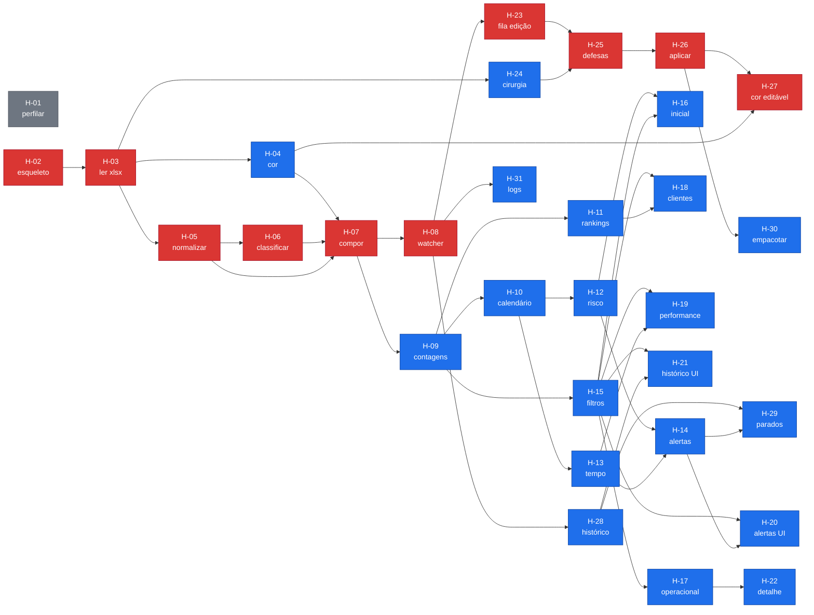

# 07 — Plano de Entrega, Sequenciamento e Riscos

## 1. Fases

Cada fase termina em software **utilizável por quem usa a planilha hoje**.
Nenhuma fase entrega apenas infraestrutura.

> **As cinco fases cobrem o plano original, e só ele.** Os épicos que nasceram
> depois — `E8` (configuração alcançável), `E9` (estilização), `E10` (melhorias
> de uso) e `E11` (a casca redesenhada) — **não têm fase atribuída**, e a ordem
> entre eles vive no cabeçalho de cada épico, em `06-backlog.md`. A regra vigente
> em 31/08/2026: `E9` e `E10` estão abertos ao mesmo tempo e não se bloqueiam;
> **`E11` vem depois dos dois**, porque `H-45` e `H-46` tocam os mesmos 25
> arquivos que ele reescreve, `H-47` era a linha de base da verificação no
> navegador — **e ela fechou em 31/08/2026**, deixando `H-67` a `H-72` no lugar
> —, e `H-50` ainda muda o que três telas dizem.

### Fase 0 — Perfilamento ✅ CONCLUÍDA em 03/08/2026

| | |
|---|---|
| **Histórias** | H-01 — implementada em `tools/profile_workbook.py` |
| **Resultado** | [perfilamento/RESULTADO.md](perfilamento/RESULTADO.md). P-01 a P-07 resolvidas; achados A-46 a A-55; `config/color-map.json` e `config/status-aliases.json` gerados com valores medidos |
| **Entregável** | Relatório JSON e Markdown com a estrutura real da planilha |
| **Critério de saída** | ✅ Atendido: P-01 a P-07 resolvidas; RNF-01 e RNF-03 a RNF-07 com origem `medido`; `config/color-map.json` cobrindo 100% das linhas |
| **Achado que mudou o plano** | A-49 — a escrita de cor de `H-27` estava errada; corrigida de `styleId` para `fillId` **antes** de virar código |

> Esta fase existe porque **é proibido reportar número derivado de dado sem
> execução real de código**. Ela já se pagou: encerrou o risco de maior impacto
> do projeto (R-03) e corrigiu um defeito em `H-27` que só apareceria na Fase 4.

### Fase 1 — Leitura confiável ✅

> ✅ **CONCLUÍDA em 04/08/2026.** Critério de saída atingido com folga: **649
> linhas, 649 aceitas, quarentena 0%** para um limite de 2% (RNF-24). Parse em
> 111–144 ms (RNF-13 admite 10 s); recarga automática em 2092 ms no pior caso
> (RNF-14 admite 5 s). Suíte em **195 testes**.

| | |
|---|---|
| **Histórias** | H-02 ✅, H-03 ✅, H-04 ✅, H-05 ✅, H-06 ✅, H-07 ✅, H-08 ✅, H-31 ✅ |
| **Entregável** | Aplicação que abre a planilha, classifica todas as linhas, recarrega sozinha quando o arquivo muda, e apresenta o relatório de quarentena e divergências |
| **Critério de saída** | Taxa de quarentena **≤ 2%** (RNF-24); 100% das linhas com REF lidas ou explicitamente quarentenadas (RNF-25); a soma das 4 categorias iguala o total de processos. **Alvo medido:** as 649 linhas da aba `2026` devem ser aceitas, com quarentena **0%** — o `color-map.json` cobre as 9 chaves e não há REF duplicada ou vazia |
| **Valor para o operador** | Já responde "quantos processos existem e em que categoria estão", e revela sujeira que hoje passa despercebida na planilha |

### Fase 2 — Painel completo, somente leitura

| | |
|---|---|
| **Histórias** | H-09 ✅, H-32, H-10 a H-22, H-28, H-29, H-30. `H-32` precede `H-15`, que exibe seus sinais na faixa da casca (A-58) |
| **Entregável** | As 6 páginas da especificação, os 11 filtros globais, 21 indicadores, os 6 alertas e o atalho de execução |
| **Critério de saída** | Todo indicador e todo alerta da matriz de rastreabilidade marcado como implementável está implementado e coberto por teste com dado concreto; o operador consegue responder na tela todas as perguntas que hoje responde abrindo a planilha |
| **Valor para o operador** | **Esta é a fase que substitui a leitura manual da planilha.** A partir daqui o painel é útil todo dia, mesmo sem edição |

### Fase 3 — Edição de texto e data, com escrita protegida

| | |
|---|---|
| **Histórias** | H-23, H-24, H-25, H-26 |
| **Entregável** | Edição na tela, fila de pendências e comando "Aplicar alterações" com as seis defesas de integridade |
| **Critério de saída** | Um arquivo de teste com cores, autofiltro, comentário, validação de dados e formatação condicional sobrevive a uma gravação **byte a byte** em todas as entradas não alteradas do zip; as seis defesas têm teste próprio; o Excel abre o resultado sem aviso de reparo |
| **Valor para o operador** | Deixa de precisar abrir o Excel para a maioria das alterações do dia a dia |

### Fase 4 — Edição dos campos codificados em cor

| | |
|---|---|
| **Histórias** | H-27 |
| **Entregável** | Alteração de responsável, canal e localização do importador pela troca de estilo da linha |
| **Critério de saída** | A troca substitui apenas o `fillId` dentro do `cellXf`, preservando `fontId`, `borderId` e `numFmtId` de cada célula (A-49); altera apenas as colunas A–L; preserva valores e os estilos próprios de M–P (A-44) |
| **Valor para o operador** | Fecha o ciclo: nenhuma alteração corriqueira exige mais o Excel |

---

## 2. Grafo de dependências



Em vermelho, o caminho crítico.

**`H-16` a `H-21` são paralelas no grafo** (`H15 --> H16 & H17 & …`), não uma
cadeia: a ordem numérica é do backlog, não dependência. Só `H-22` tem
pré-requisito próprio — `H-17`, de onde se chega ao detalhe.

---

## 3. Caminho crítico

Derivado do grafo, não de calendário. Convertendo tamanho em sessões pela taxa
de P-13 (**P = 1 · M = 2 · G = 4**):

```
H-02 (2) → H-03 (2) → H-05 (1) → H-06 (1) → H-07 (2) → H-08 (2)
        → H-23 (2) → H-25 (2) → H-26 (2) → H-27 (2)
```

**Comprimento: 18 sessões.** Excluindo a Fase 4, a cadeia mais longa termina em
H-30, com 17 sessões.

### O que encurtaria a cadeia

| Ação | Ganho | Custo |
|---|---|---|
| **Fazer `H-23` depender de `H-07` em vez de `H-08`** — a fila de edições precisa do conjunto de processos, não do watcher | **−2 sessões** | Nenhum. A dependência declarada é conservadora; se `H-23` for implementada contra `process-store` sem o recarregamento automático, o watcher entra depois sem retrabalho |
| Iniciar `H-24` em paralelo desde o fim de `H-03` | −0 no caminho crítico, mas remove H-24 do caminho de `H-25` | Nenhum — já está fora do caminho crítico |
| Adiar `H-27` para depois da entrega | −2 sessões até a última entrega | A edição de responsável e canal continua exigindo o Excel |
| Adiar `H-11`, `H-18` e `H-19` | Não encurta o caminho crítico | A Página Clientes e a Página Performance saem do escopo inicial |

O gargalo real é a cadeia **leitura → classificação → composição → fila →
escrita**, que é sequencial por natureza: cada elo consome o contrato do
anterior. Paralelizar o trabalho de interface (E4) contra o de escrita (E5) é o
único ganho estrutural disponível.

---

## 4. Esforço

**Taxa de conversão declarada (P-13):** P = 1 sessão · M = 2 sessões ·
G = 4 sessões. A taxa é **premissa**, não medição — não há base empírica deste
time neste código, porque o código não existe.

| Fase | Histórias | P | M | Sessões (soma) | Faixa (±40%) |
|---|---|---|---|---|---|
| Fase 0 | 1 | 0 | 1 | 2 | 1 – 3 |
| Fase 1 | 8 | 4 | 4 | 12 | 7 – 17 |
| Fase 2 | 17 | 11 | 6 | 23 | 14 – 32 |
| Fase 3 | 4 | 0 | 4 | 8 | 5 – 11 |
| Fase 4 | 1 | 0 | 1 | 2 | 1 – 3 |
| **Total** | **31** | **15** | **16** | **47** | **28 – 66** |

**Faixa total: 28 a 66 sessões de implementação.**

Nenhuma conversão para horas é apresentada. Precisão decimal em horas seria
falsa precisão sem base empírica; a faixa larga é a representação honesta da
incerteza. A taxa deve ser recalibrada após a Fase 1, quando houver 8 histórias
concluídas para medir.

---

## 5. Riscos

Probabilidade (1–5) × Impacto (1–5) = Score. Ordenado por score decrescente.
Cada risco tem **gatilho observável** — o sinal concreto de que está se
materializando.

### R-01 · Duplicidade de operação: edição simultânea no Excel e no painel — score 16

| | |
|---|---|
| **Probabilidade** | 4 — o operador tem os dois abertos e o hábito do Excel é antigo |
| **Impacto** | 4 — escrita perdida silenciosa, ou conflito de sincronização do OneDrive |
| **Gatilho observável** | Ocorrência de `write.refused` com `errorCode: ARQUIVO_MUDOU` nos logs; aparecimento de arquivo `-Cópia em conflito de` na pasta |
| **Mitigação preventiva** | Verificação de hash antes de gravar (H-25) recusa a escrita em vez de sobrescrever; detecção de lock impede gravar com o Excel aberto; a interface exibe permanentemente o horário da última leitura |
| **Contingência** | O diálogo de conflito (H-26) mostra, campo a campo, o valor de quando se editou, o valor atual e o pretendido. O operador decide. Nenhuma edição é descartada automaticamente |

### R-02 · Colisão de dimensões na cor da linha — score 15

| | |
|---|---|
| **Probabilidade** | 5 — é **certo** que ocorra: A-31 demonstra que uma linha só tem uma cor, e a cor codifica responsável, canal e localização do importador |
| **Impacto** | 3 — um processo do Colaborador 1 em Canal Vermelho perde a informação de responsável |
| **Gatilho observável** | Contagem de `responsible: 'indefinido'` no ranking por responsável desproporcional ao volume total |
| **Mitigação preventiva** | Os três campos são independentes e admitem `indefinido`; a aplicação **nunca** infere um a partir do outro; o ranking exibe `indefinido` como categoria visível, e não o esconde |
| **Contingência** | Acrescentar as colunas `RESPONSÁVEL` e `CANAL` em texto, como §8 da especificação já sugere. A decisão do usuário foi não criar colunas novas; o custo dessa decisão está registrado em `03-modelo-dados.md §5` |

### ~~R-03 · Datas armazenadas como texto, sem ano~~ — **ENCERRADO** (score era 15)

> **Não se materializou.** `H-01` mediu 1.201 células de data nas colunas ETA2,
> RG e DOCS ENVIADOS: **todas são seriais reais do Excel**, e **zero** são texto
> sem ano. O formato `dd/mmm` das fotos era exibição, não conteúdo. Os 12
> indicadores e 4 alertas que dependiam disso estão implementáveis, e a regra 5
> de TD-03 permanece no código como defesa sem ser exercitada.
>
> Registro original, mantido para histórico:

<details><summary>Análise original do risco</summary>

#### R-03 · Datas armazenadas como texto, sem ano — score 15

| | |
|---|---|
| **Probabilidade** | 3 — as fotos mostram `29/jul` e `04/ago`, formato compatível tanto com data real quanto com texto |
| **Impacto** | 5 — **todos** os indicadores de calendário, atraso e tempo ficam sem base. IND-07 a IND-09, IND-12, IND-14 a IND-16, IND-22, ALE-01, ALE-02, ALE-04 e ALE-05 ficariam bloqueados |
| **Gatilho observável** | `dateColumns[].textWithoutYearCount > 0` no relatório de `H-01`; anomalias `DATA_SEM_ANO` no relatório de quarentena |
| **Mitigação preventiva** | `H-01` é a **primeira** história, justamente para revelar isso antes de qualquer implementação dependente. TD-03 nunca infere o ano: uma data ausente é visível, uma data errada não |
| **Contingência** | Converter as colunas de data para tipo Data no Excel — operação de uma vez, feita pelo operador com o suporte do relatório de `H-01`, que lista linha a linha as células afetadas. Sem isso, os indicadores citados vão para a matriz de rastreabilidade como bloqueados |

</details>

### R-04 · Sujeira nos dados legados acima do previsto — score 12

| | |
|---|---|
| **Probabilidade** | 4 — planilha manual de anos, sem restrição de integridade |
| **Impacto** | 3 — indicadores corretos porém pouco úteis: rankings fragmentados, categorias distorcidas |
| **Gatilho observável** | `quarantineRate > 2%` (RNF-24); número de grupos em um ranking muito acima do número real de clientes; muitas anomalias `VARIANTE_STATUS_PROXIMA` |
| **Mitigação preventiva** | Nada é descartado em silêncio (RF-06); a normalização determinística absorve caixa, acento e espaço; o relatório de divergências lista o que precisa de decisão humana |
| **Contingência** | Acrescentar entradas a `status-aliases.json` e a `color-map.json` — configuração, sem recompilar. A limpeza da planilha em si é decisão do operador, com a lista de linhas em mãos |

### R-05 · Cores de tema não resolvidas para RGB — score 12

| | |
|---|---|
| **Probabilidade** | 3 — defeito real e aberto desde 2021 ([issue #1690](https://github.com/exceljs/exceljs/issues/1690)); ocorre quando a planilha usa cores do tema em vez de cores explícitas |
| **Impacto** | 4 — sem a cor, os três campos derivados ficam indefinidos para as linhas afetadas |
| **Gatilho observável** | `styleKeys` do relatório de `H-01` contendo chaves no formato `theme:N\|tint:...`; alta contagem de `COR_NAO_MAPEADA` na quarentena |
| **MEDIDO em 03/08/2026** | **Praticamente não ocorre.** Das 9 chaves da aba `2026`, **8 são `argb` explícito** e apenas 1 é de tema (`theme:0\|tint:0.0000`, 1 linha). Nenhuma tem `tint` diferente de zero. **Score efetivo cai de 12 para 4** |
| **Mitigação preventiva** | **A arquitetura já neutraliza o defeito**: a chave de estilo é usada literalmente, sem conversão para RGB (ADR-0003). Uma chave `theme:4\|tint:-0.2500` é tão mapeável quanto `argb:FF00B050`, desde que esteja em `color-map.json` |
| **Contingência** | Acrescentar a chave ao mapa — configuração, não código. É por isso que este risco tem impacto 4 e não 5 |
| **REFORMULADO em 18/08/2026** | `H-33` tirou o ExcelJS do caminho de leitura, e com ele o defeito #1690 que dava nome ao risco. O que sobra não é defeito de biblioteca: `theme` mais `tint` é como o OOXML **guarda** a cor de tema, e não resolvê-la para RGB é a decisão do ADR-0003, não uma limitação. O risco residual — cor de tema nova, ausente do mapa — é o mesmo de qualquer cor nova, e a contingência acima continua sendo a resposta |

### R-06 · Conflito de sincronização do OneDrive durante a gravação — score 12

| | |
|---|---|
| **Probabilidade** | 3 — a pasta é sincronizada continuamente e a gravação não tem como coordenar com o agente do OneDrive |
| **Impacto** | 4 — arquivo `-Cópia em conflito de` cria duas verdades |
| **Gatilho observável** | Arquivo com sufixo de conflito na pasta; hash divergente logo após uma gravação bem-sucedida |
| **Mitigação preventiva** | Gravação atômica (temporário + renomeação) reduz a janela de exposição a milissegundos; backup antes de cada escrita; validação pós-escrita detecta o problema imediatamente |
| **Contingência** | Restaurar o backup mais recente e refazer a aplicação com o OneDrive pausado. O procedimento está no `README.md` da raiz (H-30) |

### R-07 · Operador continua editando só no Excel e ignora o painel — score 8

| | |
|---|---|
| **Probabilidade** | 4 — o hábito da planilha é de anos e o painel é novo |
| **Impacto** | 2 — o painel continua correto e útil para **leitura**; apenas o ciclo de edição não é adotado |
| **Gatilho observável** | Fila de edições permanentemente vazia; `write.done` ausente dos logs por semanas; releituras frequentes disparadas por alterações externas |
| **Mitigação preventiva** | A arquitetura **não exige** adoção: a planilha continua sendo a fonte da verdade, e editar no Excel é um caminho plenamente suportado (D1). O painel não quebra se ninguém usar a edição |
| **Contingência** | Nenhuma ação corretiva necessária — este é o cenário de menor risco do projeto, e foi desenhado para ser aceitável. Se a edição nunca for adotada, as Fases 3 e 4 podem ser descontinuadas sem afetar as Fases 0 a 2 |

> Este risco é o análogo local de "resistência da equipe a abandonar a
> planilha". Ele tem score baixo **por decisão de arquitetura**: a planilha não
> precisa ser abandonada.

### R-08 · Corrupção do arquivo durante a gravação — score 10

| | |
|---|---|
| **Probabilidade** | 2 — três defesas independentes precisariam falhar juntas |
| **Impacto** | 5 — perda da planilha de trabalho da empresa |
| **Gatilho observável** | `write.restored` nos logs; Excel exibindo aviso de reparo ao abrir |
| **Mitigação preventiva** | Nunca reserializar a planilha com uma biblioteca de `.xlsx` (ADR-0004, três defeitos citados); gravação atômica; backup antes; validação por releitura após |
| **Contingência** | Restauração automática do backup (H-25), com o caminho informado ao operador. `data/backups/` mantém 30 cópias ou 90 dias (RNF-21) |

### R-09 · ExcelJS sem manutenção ativa — score 9 · ✅ FECHADO

| | |
|---|---|
| **Probabilidade** | 3 — sem release relevante desde outubro de 2023 |
| **Impacto** | 3 — defeito novo de leitura não teria correção upstream |
| **Gatilho observável** | Falha de leitura em arquivo que o Excel abre normalmente |
| **Mitigação preventiva** | ExcelJS é usado **apenas para leitura**; a escrita não depende dele (ADR-0004). A superfície exposta ao risco é pequena e está isolada em `src/io/xlsx-reader.ts` |
| **Contingência** | Substituir apenas o leitor, mantendo o contrato `readWorkbook`. SheetJS Community está descartado por não ler estilos ([issue #3214](https://git.sheetjs.com/sheetjs/sheetjs/issues/3214)); a alternativa seria leitura direta do XML com `fflate`, que já é dependência do projeto pela escrita |
| **FECHADO em 18/08/2026** | A contingência virou o caminho principal. `H-33` trocou o leitor por leitura direta do XML com `fflate`, o contrato `readWorkbook` ficou intacto, e o `exceljs` saiu de `package.json` — 1.084 linhas a menos em `package-lock.json`. Não há mais superfície exposta: nenhum arquivo de `src/` o importa |

### R-10 · Volume acima do que a estratégia em memória comporta — score 6

| | |
|---|---|
| **Probabilidade** | 2 — planilha manual editada à mão tem limite prático de tamanho |
| **Impacto** | 3 — parse lento e consumo de memória alto |
| **Gatilho observável** | Tempo de parse acima de 10 s (RNF-13) ou memória do processo acima de 512 MB (RNF-16), ambos registrados em `read.done` pelos logs de `H-31` |
| **Mitigação preventiva** | `H-01` mede o volume antes de qualquer implementação |
| **MEDIDO em 03/08/2026** | **649 linhas × 16 colunas, arquivo de 293 KB.** Ordens de magnitude abaixo de qualquer limiar de preocupação. **Score efetivo cai de 6 para 1.** O ADR-0006 fica confortável mesmo se o arquivo quintuplicar |
| **Contingência** | Leitura em fluxo do XML da aba e cálculo incremental dos indicadores. Isso alteraria o ADR-0006 e é a única contingência do plano que exigiria revisão de decisão estrutural |

### R-11 · Coluna E ou coluna P diferentes do suposto — score 6

| | |
|---|---|
| **Probabilidade** | 2 — a dedução de E = AGENTE é sólida por eliminação, mas não verificada |
| **Impacto** | 3 — IND-17 e o filtro de agente ficariam sem fonte |
| **Gatilho observável** | `columns[E].header` diferente de "AGENTE" no relatório de `H-01` |
| **Mitigação preventiva** | `H-01` precede toda implementação dependente |
| **MEDIDO em 03/08/2026** | **ENCERRADO.** Coluna E = `AGENTE` (576 valores, 35 distintos); coluna P = `Coluna1`, 99,9% vazia. As duas premissas confirmadas |
| **Contingência** | Não é mais necessária |

### R-12 · TypeScript 7.0.2 incompatível com a cadeia de build — score 4

| | |
|---|---|
| **Probabilidade** | 2 — versão nativa recente; Vite 8 e Vitest 4 podem não estar plenamente alinhados |
| **Impacto** | 2 — troca de versão, sem efeito no desenho |
| **Gatilho observável** | `npm run build` falhando em `H-02` |
| **Mitigação preventiva** | Fallback já fixado e declarado: `typescript@5.9.3` |
| **Contingência** | Fixar 5.9.3 no `package.json`. Não há avaliação a fazer: o critério é objetivo — a build passa ou não passa |

### R-13 · Credenciais expostas na aba CNPJ — score 12 (**novo, revelado por H-01**)

| | |
|---|---|
| **Probabilidade** | 4 — já está acontecendo: as credenciais estão no arquivo hoje |
| **Impacto** | 3 — para **este projeto**, nenhum: a aba é excluída do escopo e nunca é lida. O impacto é organizacional |
| **Gatilho observável** | A aba `CNPJ` contém credenciais de terceiros, num arquivo sincronizado com o SharePoint da organização |
| **Mitigação preventiva** | A aplicação **não lê, não exibe e não registra** a aba `CNPJ` (achado A-47). O relatório de perfilamento versionado foi sanitizado antes de entrar no repositório |
| **Contingência** | Fora do escopo técnico deste projeto: mover as credenciais para um gerenciador de senhas é decisão do operador e da organização. Fica registrado porque foi descoberto aqui, e omitir seria pior |

### R-14 · Virada de ano exige nova aba e reconfiguração — score 9 (**novo**)

| | |
|---|---|
| **Probabilidade** | 3 — acontecerá com certeza, mas em data previsível |
| **Impacto** | 3 — o painel apontaria para a aba do ano anterior e pareceria congelado |
| **Gatilho observável** | Surgimento de uma aba `2027` no arquivo; ou ETA2 máximo do painel parando de avançar |
| **Mitigação preventiva** | A aba é **configuração**, não código: alterar `sheetName` em `config/app.json`. O `README.md` da raiz documenta o procedimento, e `tools/profile_workbook.py` fica versionado para reperfilar a aba nova |
| **Contingência** | Reexecutar `H-01` sobre a aba nova, conferir se o esquema de colunas se manteve (as abas `2025` e `2024` provam que **ele muda entre anos**) e atualizar `color-map.json` se as cores mudarem |

### R-15 · Escrita de cor precisa acrescentar `xf` a `styles.xml` — score 6 (**novo, revelado por H-01**)

| | |
|---|---|
| **Probabilidade** | 3 — ocorre sempre que a combinação `(fillId alvo, fontId, borderId, numFmtId)` da célula ainda não existir em `cellXfs` |
| **Impacto** | 2 — a operação é aditiva e não altera nenhum `xf` existente |
| **Gatilho observável** | Crescimento de `cellXfs` em `xl/styles.xml` após uma edição de cor |
| **Mitigação preventiva** | O algoritmo de TD-05.1 **reutiliza** um `xf` existente sempre que possível, e só acrescenta quando não há. Nenhum `xf` anterior é modificado, logo nenhuma célula fora da edição muda de aparência |
| **Contingência** | Se a validação pós-escrita falhar, o backup é restaurado automaticamente (`H-25`). Este é o único ponto do projeto em que `xl/styles.xml` é tocado, e apenas na Fase 4 |

### R-16 · O redesenho reintroduz os defeitos de contraste que `E9` fechou — score 12 (**novo, revelado ao alinhar `E11`**)

| | |
|---|---|
| **Probabilidade** | 4 — **já ocorreu**, antes de qualquer código: seis pares da paleta proposta reprovam, e três deles são exatamente os tokens que `H-39` e `H-40` corrigiram (`text-muted` volta de 4,77:1 para 3,35:1; `border-control`, de 4,77:1 para 1,59:1) |
| **Impacto** | 3 — regressão de acessibilidade sem sintoma visível, num projeto cuja guarda automática não a alcança |
| **Gatilho observável** | Valor de token alterado em `web/src/index.css` sem a conta de contraste ao lado. `tests/repo/estilo.test.ts` proíbe **passo bruto de paleta**, e não valor de token com contraste insuficiente — o defeito passa verde |
| **Mitigação preventiva** | `H-57` nasce com os seis valores corrigidos já calculados (`redesign/PROPOSTA.md §2.2`), pelo mesmo desenho de `H-39`; e acrescenta a asserção de par completo por esquema, provada por mutação |
| **Contingência** | `H-65` reexecuta os seis procedimentos de navegador **nos dois esquemas** — é lá que aparece o que a estática não vê, como cor resolvida sobre o véu do diálogo |

### Mapa de riscos

Scores revistos após `H-01` (03/08/2026).

| Score | Risco | Situação |
|---|---|---|
| 16 | R-01 Duplicidade de operação | inalterado — segue o maior risco |
| 15 | R-02 Colisão de dimensões na cor | **confirmado pelo dado**: 477 linhas verdes ficam sem responsável |
| 12 | R-04 Sujeira nos dados legados | reduzido na prática: 0 REF duplicada, 0 REF vazia, quarentena esperada 0% |
| 12 | R-06 Conflito de sincronização do OneDrive | inalterado |
| 12 | R-13 Credenciais na aba CNPJ | **novo** |
| 12 | R-16 Redesenho regride o contraste de `E9` | **novo** — seis pares já reprovados na paleta proposta |
| 10 | R-08 Corrupção na gravação | inalterado |
| — | R-09 ExcelJS sem manutenção | **fechado por `H-33`** — a dependência saiu do projeto |
| 9 | R-14 Virada de ano | **novo** |
| 8 | R-07 Painel não adotado para edição | inalterado — aceitável por desenho |
| 6 | R-15 `xf` novo em `styles.xml` | **novo** |
| **4** | R-05 Cores de tema não resolvidas | **reduzido de 12** — 8 das 9 chaves são `argb` explícito; reformulado por `H-33`, que tirou o defeito de biblioteca da conta |
| 4 | R-12 TypeScript 7 incompatível | inalterado |
| **1** | R-10 Volume acima do previsto | **reduzido de 6** — 649 linhas, 293 KB |
| — | ~~R-03 Datas como texto~~ | **ENCERRADO** — 1.201 datas reais, zero texto sem ano |
| — | ~~R-11 Coluna E ou P~~ | **ENCERRADO** — ambas confirmadas |

**A Fase 0 se pagou.** Encerrou dois riscos (um deles o de maior impacto do
projeto), reduziu dois, revelou três que o plano não antecipava, e corrigiu um
defeito em `H-27` que só apareceria na Fase 4 — quando já houvesse código
escrito sobre a premissa errada.
